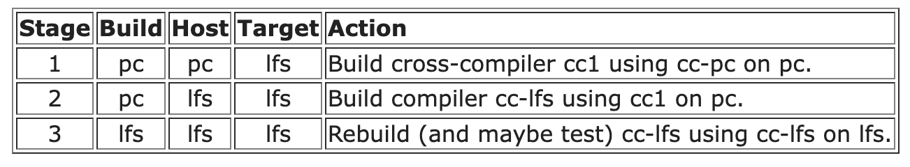

# kfs_vmenv (ft_linux)

> Build your own Linux system from scratch — not by using it, but by understanding every layer that makes it boot.

---

### Objectives

* Build a bootable Linux system from scratch
* Understand cross-compilation and toolchain isolation
* Compile and configure a custom Linux kernel (4.x)
* Design and initialize a root filesystem
* Configure bootloader and init system

This project is not about installing Linux. It is about understanding how Linux is constructed.

## 1.2 LFS / BLFS / ALFS Relationship

```
Host System (Debian 10)
        │
        ▼
LFS  (Linux From Scratch)
        │
        ▼
BLFS (Beyond Linux From Scratch)
        │
        ▼
ALFS (Automated Linux From Scratch)
```

### LFS (Linux From Scratch)

* Manual construction of a Linux system from source
* Build temporary toolchain
* Construct root filesystem
* Build kernel and boot system

This project follows the LFS methodology.
https://www.linuxfromscratch.org/museum/lfs-museum/8.4/LFS-BOOK-8.4-HTML/

### BLFS (Beyond Linux From Scratch)

* Extends LFS with additional userland components
* GUI, networking services, system utilities
* Used for expanding the base system

Not the core focus of this project.

### ALFS (Automated Linux From Scratch)

* Automates LFS build process
* Script-based system construction

`bootstrap.sh` in this repository acts as an ALFS-style automation layer.

---

## 2.1 Build Pipeline Overview

The build pipeline is orchestrated by a single entry script (root-only) that defines environment variables, step dependencies, and execution modes.

### High-Level Execution Flow

```
bootstrap.sh (root)
    │
    ├── Export global environment variables
    ├── Define ordered build steps
    ├── Provide execution modes (--auto / --step / --from)
    └── Execute each step with error isolation
```

### Environment Initialization

At startup, the script defines and exports all critical build variables:

* `ARCH` – Host architecture (`uname -m`)
* `KERNEL_VERSION` – Target kernel version (e.g. 4.20.12)
* `KERNEL_URL` – Kernel source location
* `IMAGE` / `IMAGE_SIZE` – Virtual disk image configuration
* `MNT_ROOT`, `ROOT_MNT`, `BOOT_MNT` – Mount layout
* `LFS` – Root of the LFS target system
* `LFS_TGT` – Cross-compilation triplet (`<arch>-lfs-linux-gnu`)

This guarantees that every sub-script shares a consistent and reproducible build context.

### Core Build Stages

The effective build stages are:

1. `cleanup` – Reset tools and temporary environment
2. `create_disk` – Create and partition disk image
3. `init_lfs` – Initialize LFS directory structure
4. `link_tools` – Prepare `/tools` symbolic links
5. `build_temp_toolchain` – Build temporary cross toolchain (Chapter 5)
6. `finalize_tools_owner` – Hand ownership of `/tools` to root
7. `mount_lfs` – Mount virtual partitions
8. `build_lfs_toolchain` – Build final toolchain inside chroot (Chapter 6)
9. `install_bootscripts` – Install SysV boot scripts
10. `config_system` – Configure hostname, fstab, networking
11. `build_kernel` – Compile Linux kernel
12. `config_bootloader` – Generate bootloader configuration
13. `install_grub` – Install GRUB into disk image
14. `init_blfs` / `build_blfs` – Optional BLFS expansion layer

### Dual-Mode chroot Strategy

The script automatically switches between two chroot modes:

#### Legacy chroot (temporary toolchain stage)

Uses:

* `/tools/bin/env`
* `/tools/bin/bash`
* PATH includes `/tools/bin`

Used during early Chapter 6 build.

#### Revised chroot (final system stage)

---

## 2.2 Host Environment Preparation

### Host Requirements

* Debian 10.13
* sudo privileges
* Required development tools (see `scripts/setup_host_env.sh`)

### Why Debian 10.13?

* Compatible with Linux kernel 4.x
* Stable glibc and binutils versions
* Avoid incompatibilities with newer distributions

---

# 3. Technical Deep Dive

---

## 3.1 Essential System Inspection Commands

### Check Current Partition Layout

```sh
lsblk -f

NAME   FSTYPE LABEL UUID                                 MOUNTPOINT
sda
├─sda1 ext2         xxxx-xxxx                            /boot
├─sda2 ext4         yyyy-yyyy                            /
└─sda3 swap         zzzz-zzzz                            [SWAP]

fdisk -l
blkid
```

These commands allow inspection of:

* Block devices
* Partition tables
* Filesystem types

---

### Check Current Kernel Version

```sh
uname -r
```

Or:

```sh
cat /proc/version
```

Kernel images are typically located in:

```
/boot/vmlinuz-*
```

---

### Check Hostname

```sh
hostname
cat /etc/hostname
```

The hostname is configured in userland and not hardcoded in the kernel.

---

## 3.2 Disk Partition Design

Reference: `scripts/create_disk.sh`

### Example Layout

```
/dev/sda1  /boot   ext2
/dev/sda2  /       ext4
/dev/sda3  swap
```

### Design Considerations

* **ext2 for /boot**: simple and stable
* **ext4 for /**: journaling support and robustness
* **swap partition**: allows memory pressure experimentation

---

## 3.3 Key System Components

### 1. SysV Init

LFS uses a traditional SysV-style init system.

It is responsible for:

* starting services
* mounting filesystems
* setting hostname
* handling runlevels

Boot sequence:

```
BIOS
 → GRUB
 → Kernel
 → /sbin/init
 → rc scripts
```

Runlevels define system states.

---

### 2. GRUB

GRUB (GRand Unified Bootloader) is responsible for loading the Linux kernel into memory and passing control to it.

BIOS/UEFI → GRUB → Linux kernel → init process

* Loads kernel image
* Passes root filesystem parameters

---

### 3. udev

Dynamic device management system.

* Kernel emits device events
* udev creates device nodes in `/dev`
* Enables dynamic hardware recognition

Ref: ./scripts/config_system.sh (udev rules)

---

### 2️⃣ Linux Kernel

**What it is:**
The kernel is the core of the operating system. It manages:

* CPU scheduling
* memory management
* virtual memory
* device drivers
* filesystems
* process isolation

**Why it matters in LFS:**
You compile the kernel yourself. This means:

* You choose which drivers are built-in.
* You decide whether filesystems are modular or static.
* You control hardware support.

In LFS, the kernel is not a black box — it is explicitly configured and built as part of the system construction.

This is where your system becomes a real OS rather than just a toolchain sandbox.

---

### 3️⃣ Temporary Toolchain (Chapter 5)

**What it is:**
A minimal compiler environment built in `/tools`, including:

* Binutils
* GCC (stage 1)
* Glibc

**Why it exists:**
It isolates the final system from the host distribution.

Without this step, your final system would accidentally link against host libraries — breaking purity.

**Conceptually:**
Host system → Temporary toolchain → Final LFS system

This stage ensures that the final LFS binaries are self-contained and independent.

---

### 4️⃣ Final Toolchain (Chapter 6)

After entering chroot, you rebuild:

* Binutils
* GCC
* Glibc
* Core system libraries

**Why rebuild again?**
Because now everything is built *inside* the LFS root using the temporary toolchain.

This removes all host contamination and produces a clean, self-hosted system.

This is the architectural turning point of LFS.

---

### 5️⃣ Glibc

**What it is:**
The GNU C Library — the interface between user-space programs and the kernel.

It provides:

* system call wrappers
* memory allocation (malloc)
* POSIX APIs
* dynamic linking

**Why it is critical in LFS:**
Almost every user program depends on glibc.
If glibc is wrong, the entire system collapses.

In LFS, glibc defines the ABI of your system.

---

### 6️⃣ Coreutils, Bash, and Essential Userland Tools

These provide:

* `ls`, `cp`, `mv`, `cat`
* shell execution (`bash`)
* text processing (`sed`, `grep`, `awk`)

In modern distributions, these are invisible background components.
In LFS, you build them explicitly, which reveals:

* dependency ordering
* toolchain reliance
* filesystem hierarchy requirements

This is where your system transitions from “bootable” to “usable.”

---

### 8️⃣ Filesystem Hierarchy (FHS)

LFS enforces manual creation of:

* `/bin`
* `/usr`
* `/lib`
* `/etc`
* `/var`

This teaches:

* separation of static vs variable data
* runtime vs configuration
* toolchain vs system binaries

In LFS, the filesystem layout is not assumed — it is constructed deliberately.

---

## 3.4 System Integration Perspective

Cross Compilation Principles

Reference:
[https://www.linuxfromscratch.org/lfs/view/stable/partintro/toolchaintechnotes.html](https://www.linuxfromscratch.org/lfs/view/stable/partintro/toolchaintechnotes.html)




### Build / Host / Target

```
build  → where compilation happens
host   → where resulting binaries will run
target → architecture the compiler generates for
```

Example:

* build: Debian VM
* host: LFS chroot environment
* target: x86_64-lfs-linux-gnu

---

### Why Temporary Toolchain?

* Avoid linking against host libraries
* Ensure system self-consistency
* Prevent contamination of host environment

### Multi-Stage Build Model

```
Phase 1: Build temporary toolchain
Phase 2: Enter chroot environment
Phase 3: Rebuild final system natively
```

This guarantees a clean and independent Linux system.

---

===

# How to use this project to build your own Linux system

## Pre-requisites

Depend on the subject, we need to build kernel version 4.x. To avoid to have incompatible utils, I decide to use `Debian 10.13` as host system for the virtual machine.

```sh
# For AMD64 architecture (For campus computer)
wget https://cdimage.debian.org/cdimage/archive/10.13.0/amd64/iso-cd/debian-10.13.0-amd64-netinst.iso
```

## Setup Host VM

Add current user to `sudo` group

```sh
sudo usermod -aG sudo $USER
```

Install the required packages and tools

```sh
./scripts/setup_host_env.sh
```

## Setup ft_linux

Once the host VM is ready, we can setup the `ft_linux` project with automated script.

```sh
sudo ./bootstrap.sh --auto
```
